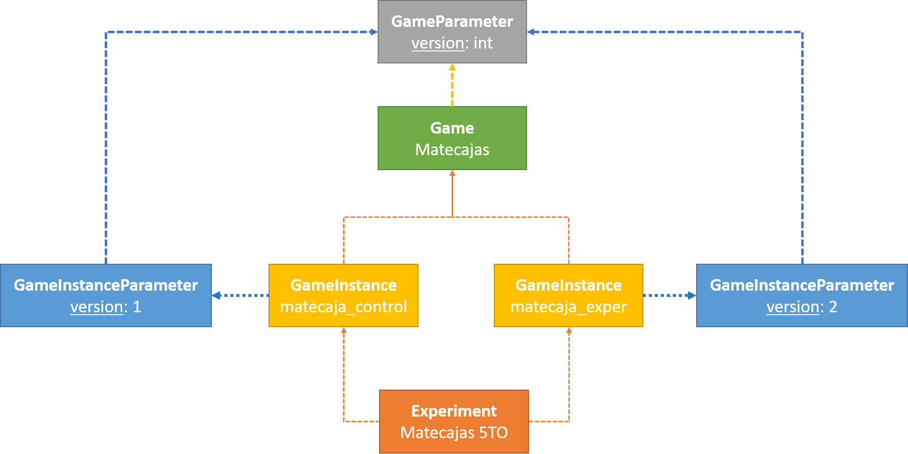

# Experimentos (Experiments)

## Estudiantes

Para los estudiantes (usuarios de la plataforma) cada experimento es un "juego".

Al acceder a un experimento, la plataforma entregará una 

## Administración

### Crear y editar experimento
- Puedes dirigirte a /experiments/new para crear un nuevo experimento
- Puedes dirigirte a /experiments/{id}/edit para editar un experimento
- Datos necesarios para crear un experimento:
    - Nombre
    - Estado Activo/Inactivo
    - Tiempo límite
    - Descripción (opcional)

## Creación de un experimento

Un experimento está compuesto de múltiples elementos, que deben estar configurados.

En el siguiente diagrama se presenta un esquema para representar de forma general su estructura.

El experimento "Matecajas 5TO" posee dos instancias de juego ("matecaja_control" y "matecaja_exper"), ambas son las versiones que se asignarán de manera intercalada a cada usuario que se registre y acceda al experimento. Es importante, tener en cuenta que el usuario final, observará el experimento "Matecajas 5TO" pero no sabrá que existen dos instancias, en este caso, y que se asignará una la primera vez que accede.

Cada juego tiene definido ninguno o muchos parámetros, en el esquema se presenta como ejemplo, el parámetro "version" de tipo entero. Por otro lado, cada una de las instancias de juego, asigna un valor a este parémtro mediante una instancia de parámetro de juego, donde se observa que "matecaja_control" tiene el parámetro "version" con el valor 1; y "matecaja_exper" tiene el parámetro "version" con el valor 2. Al tratarse del mismo juego, se espera que el desarrollador del juego haya establecido un comportamiento distinto (característica distintiva a evaluar en el experimento) con tal de probar una técnica/método/versión con cada grupo. 

### Configurar experimento

La configuración de un experimento, considera una serie de parámetros a especificar para establecer el comportamiento esperado.

Para esto, se debe considerar:

- [Instancias de juego](./experiments/game-instances.md)
- [🏁 Encuestas](./experiments/surveys.md)
- 🆗 [🏁 Puntos de entrada](./experiments/entrypoints.md)
- [👥Usuarios asociados](./experiments/associated-users.md)
- Reportes